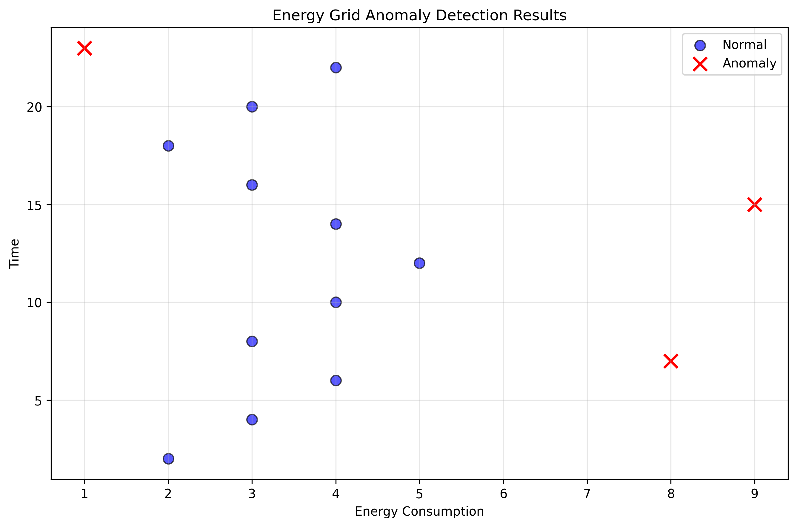

# Smart City Clustering and Anomaly Detection

## About

This project applies unsupervised machine learning techniques to smart city management problems. It includes K-Means clustering for traffic pattern grouping and Gaussian-based anomaly detection for energy grid monitoring.

The goal is to demonstrate how clustering and anomaly detection can help identify operational patterns, detect unusual behavior, and support data-driven monitoring in smart city systems.

## Project Overview

Smart cities generate data from transportation networks, energy systems, sensors, and infrastructure. Machine learning can help organize this data into meaningful patterns and flag unusual activity that may require attention.

This project contains two main components:

1. **Traffic Pattern Clustering**
   K-Means clustering is used to group traffic locations into similar spatial patterns.

2. **Energy Grid Anomaly Detection**
   A Gaussian probability model is used to identify unusual energy consumption patterns based on energy usage and time.

## Methods Used

### K-Means Clustering

The first part of the project implements K-Means clustering from scratch. The workflow includes:

* Loading traffic location data
* Initializing cluster centroids
* Assigning each point to the closest centroid
* Recomputing centroids iteratively
* Visualizing traffic clusters and centroid locations

The clustering output groups traffic points into three clusters, which can represent different traffic zones or activity patterns within a smart city environment.

### Gaussian Anomaly Detection

The second part of the project implements a Gaussian-based anomaly detection approach for energy grid monitoring. The workflow includes:

* Loading energy consumption data
* Training on normal energy behavior
* Estimating Gaussian distribution parameters
* Computing probability scores for each observation
* Selecting an anomaly threshold using F1-score
* Flagging low-probability observations as anomalies

## Anomaly Detection Visualization



The visualization shows normal energy activity and detected anomalies. Normal observations are shown in blue, while anomalous observations are highlighted in red.

The model identified **3 anomalies** in the energy grid monitoring data. These points fall outside the main pattern of normal energy behavior, making them useful candidates for further investigation.

## Key Results

| Component                    | Result                     |
| ---------------------------- | -------------------------- |
| Traffic clustering method    | K-Means clustering         |
| Number of traffic clusters   | 3                          |
| Anomaly detection method     | Gaussian probability model |
| Number of detected anomalies | 3                          |
| Threshold selection method   | F1-score optimization      |

## Interpretation

The K-Means clustering section shows how smart city traffic data can be grouped into similar regions. These clusters can help transportation teams understand spatial traffic patterns, identify activity zones, and support planning decisions.

The anomaly detection section shows how unusual energy consumption behavior can be detected using probability modeling. Observations with very low probability under the learned Gaussian distribution are flagged as anomalies. In a smart city setting, these anomalies could represent unusual demand, sensor issues, equipment faults, or other events that require monitoring.

## Important Note

This project is an educational implementation of clustering and anomaly detection methods. The algorithms are implemented manually to demonstrate the underlying logic. A production version would require larger datasets, validation across time periods, domain-specific thresholds, and integration with real-time monitoring systems.

## Repository Structure

```text
smart_city_anomaly_detection/
  data/
    traffic_data.csv
    energy_data.csv
  images/
    energy_grid_anomaly_detection.png
  notebooks/
    smart_city_anomaly_detection.ipynb
  .gitignore
  README.md
```

## Notebook

The main notebook is located at:

```text
notebooks/smart_city_anomaly_detection.ipynb
```

## Tools and Libraries

* Python
* NumPy
* Pandas
* Matplotlib
* Jupyter Notebook

## Portfolio Relevance

This project demonstrates unsupervised learning skills relevant to data science, smart city analytics, infrastructure monitoring, clustering, and anomaly detection.

## Author

Edidiong Ibokete
[GitHub Profile](https://github.com/Eddy-bok)
